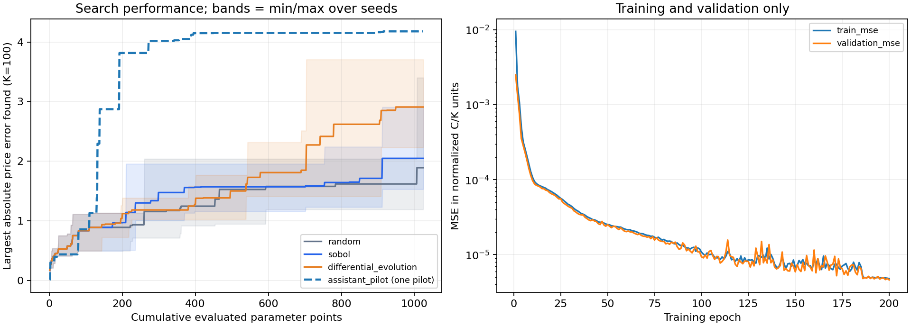

# 实际运行报告

本报告由保存的数值结果自动生成。价格误差按 K=100 换算。
本次 CPU 训练 200 个 epoch，训练计时 10.62 秒（不含环境安装与数据生成）。

## 独立审计集

| 数据集 | 样本数 | 平均绝对价格误差 | 最大价格误差 | 超阈值比例 |
|---|---:|---:|---:|---:|
| test | 8192 | 0.153322 | 2.549891 | 55.65% |
| stress | 8192 | 0.636265 | 4.137437 | 84.85% |

## 搜索基线

所有方法使用相同冻结网络、相同参数域、相同前128个Sobol点和相同总评估预算。

| 方法 | 重复次数 | 最大价格误差 mean ± sample SD | 发现失败区域数 mean | 搜索时间 mean (s) |
|---|---:|---:|---:|---:|
| random | 5 | 1.889774 ± 0.887185 | 95.0 | 0.0021 |
| sobol | 5 | 2.046231 ± 0.545082 | 102.4 | 0.0056 |
| differential_evolution | 5 | 2.907746 ± 0.532681 | 102.4 | 0.0407 |

最大误差越大表示搜索更会发现错误；不是网络变差或变好。优化最大误差与覆盖更多不同区域是不同目标。
失败区域按预先固定的6×5×4网格去重，共120格。图中基线实线是5次搜索的均值、阴影为最小/最大值；助手虚线为单次结果。

## Agent 状态

- assistant_pilot：1024 个测试点，最大价格误差 4.177486，发现 60 个失败区域，167 个点违反价格界限。仅一次 pilot，未重复验证统计优势。

## 限制

- 失败阈值预先设为 |prediction-reference|/K > 0.001，即本例0.10价格单位；不是行业统一风险阈值。
- 只有一个训练种子的网络；基线重复只反映搜索随机性，不代表跨模型泛化。
- stress集是独立设计的短期限/平值诊断分布，不是随机市场发生概率，也未用于搜索反馈。
- 神经网络测试的是对Black–Scholes的逼近；不能验证Black–Scholes的真实市场适用性。
- 会话中的region+Sobol是混合方法。助手引导pilot不是重复的Codex CLI统计实验。
- Codex CLI需要用户本机登录后验证；当前交付环境没有执行该登录路径。
- baseline时间含数值搜索，不含训练/首次加载；session时间含加载，不能与baseline当作端到端成本直接比较。

训练配置和耗时见 training_metrics.json；完整逐点评估见 baselines/ 和 sessions/。
